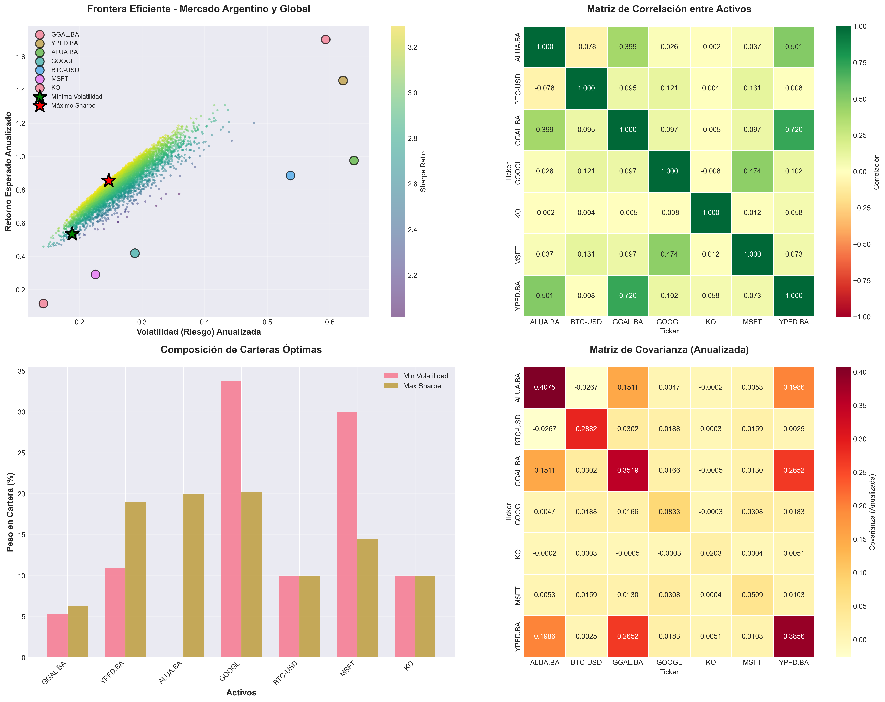
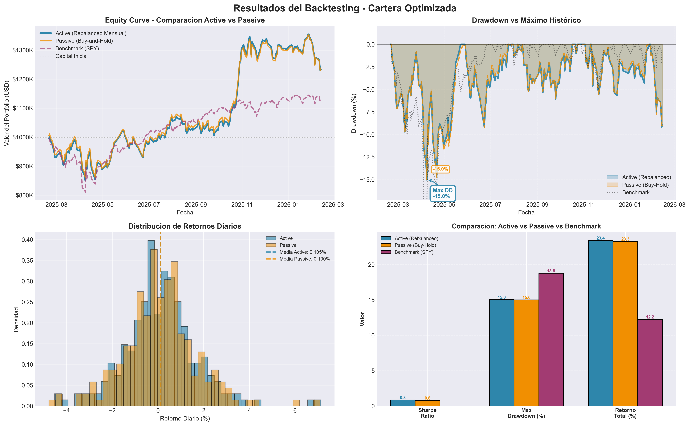
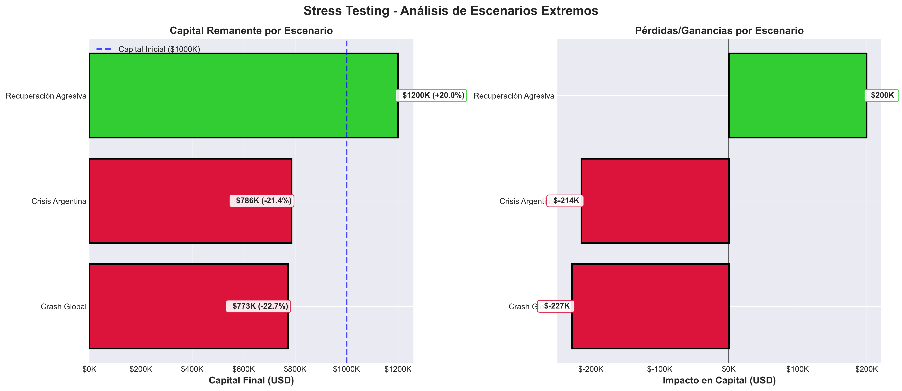

# 💼 Motor de Optimización de Carteras - Mercado Argentino y Global

**Motor cuantitativo profesional para optimización de carteras multi-asset con validación out-of-sample y análisis de riesgo avanzado**

Desarrollado por **Jorge Iván Juárez A.** - *Lic. en Economía especializado en mercado de capitales*

[](https://www.linkedin.com/in/ivan-juarez-231002vap)

---

## 🎯 Resumen Ejecutivo

Este proyecto implementa un **pipeline cuantitativo completo** para la gestión profesional de carteras de inversión, diseñado específicamente para capturar las particularidades del mercado argentino (riesgo país, volatilidad extrema) mientras mantiene una perspectiva global.

El motor es **completamente flexible** y puede optimizar cualquier combinación de activos disponibles en Yahoo Finance, desde portfolios 100% locales hasta estrategias globales diversificadas.

---

## 📊 Visualizaciones del Sistema

### Frontera Eficiente y Análisis de Correlación

*5,000 carteras simuladas Monte Carlo | Optimización de Markowitz extendida | Matrices de correlación y covarianza*

### Backtesting: Active Management vs Buy-and-Hold

*Validación histórica out-of-sample | Rebalanceo mensual con comisiones reales (0.5%) | Análisis de drawdown comparado*

### Stress Testing: Resiliencia en Escenarios Extremos

*Crash Global: -22.72% | Crisis Argentina: -21.36% | Recuperación: +20.0%*

---

## 🔍 Demostración: Portfolio Diversificado Argentina-Global

Para ilustrar las capacidades del motor, se diseñó un **portfolio real diversificado** que combina:

**Composición (7 activos - Cartera de Máximo Sharpe GESTIONADA):**
- 🇦🇷 **Mercado Argentino (45.31%):** GGAL.BA (6.30%), YPFD.BA (19.01%), ALUA.BA (20.00%)
  - Exposición al riesgo país con restricción de 20% máximo por activo
- 🌎 **Mercado Global (44.69%):** GOOGL (20.26%), MSFT (14.43%), KO (10.00%)
  - Diversificación internacional en tecnología y consumo de alta capitalización
- ₿ **Criptomonedas (10.00%):** BTC-USD (10.00%)
  - Exposición limitada por restricción máxima

> **📋 Nota Metodológica:** Los resultados que se presentan a continuación corresponden a la cartera **GESTIONADA** 
> (con restricciones por tipo de activo), elegida por su mejor balance entre eficiencia y control de riesgo. 
> El análisis incluyó también una cartera **LIBRE** (sin restricciones) con Sharpe ex-ante de 3.30, pero se 
> descartó por concentración excesiva (22% en BTC). Ver **Sección 6** del Reporte de Optimización para la 
> comparación detallada entre ambas estrategias.

**Validación Out-of-Sample (1 año - Feb 2025 a Feb 2026):**

| Estrategia | Retorno Total | Sharpe Ratio | Max Drawdown | Capital Final |
|-----------|---------------|--------------|--------------|---------------|
| **Active (Rebalanceo)** | **+23.40%** | **0.84** | -15.03% | $1,233,970 |
| Passive (Buy-Hold) | +23.25% | 0.80 | -15.00% | $1,232,520 |
| Benchmark (SPY) | +12.24% | - | -18.76% | $1,122,352 |

**Análisis de Fricción:**
- Comisiones totales (rebalanceo mensual): $10,077.56 (1.01% del capital)
- Comisiones pasivas: $5,000.00 (0.50% del capital)
- Outperformance neta vs Passive: **+0.14%** ($1,450)
- Outperformance vs Benchmark (SPY): **+11.16%**
- **Conclusión:** El rebalanceo activo NO justificó las comisiones extra vs buy-hold, pero ambas estrategias superaron al benchmark significativamente

**Stress Testing (Resiliencia en escenarios extremos):**
- Crash Global: -22.72% | Crisis Argentina: -21.36% | Recuperación: +20.00%

> **💡 Nota clave:** Este portfolio demuestra la metodología del motor. El sistema puede aplicarse a cualquier combinación de activos (2-15+), con restricciones personalizadas, diferentes períodos de análisis y estrategias de rebalanceo. Las configuraciones son completamente flexibles para adaptarse a políticas de inversión específicas. (Ver [INSTRUCCIONES.md](INSTRUCCIONES.md) )  

---

## 🔬 Metodología Cuantitativa

### 1. Train/Test Split Riguroso
El sistema implementa **validación out-of-sample genuina** para evitar overfitting:

- **Train Set (2 años):** Feb 2023 - Feb 2025 | Optimización de pesos, estimación de covarianza, cálculo de VaR ex-ante
- **Test Set (1 año):** Feb 2025 - Feb 2026 | Backtesting con datos que el modelo **nunca vio** durante la optimización

**Resultado:** Performance realista sin data leakage, metodología alineada con estándares académicos (De Prado, 2018).

> **Nota:** El período de entrenamiento es configurable en el código (variable `ANALYSIS_YEARS`). Para mayor robustez, se recomienda 3-5 años de datos históricos cuando estén disponibles.

### 2. Optimización de Markowitz Extendida

**Fundamento:** Teoría Moderna de Carteras (MPT) - Markowitz (1952)

**Implementación:**
- Matriz de covarianza anualizada desde retornos diarios (train period)
- Retornos esperados: Media histórica ajustada
- **Sharpe Ratio corregido:** (R - Rf) / σ, con rf=5% (tasa libre de riesgo)
- Restricciones personalizadas por activo (max 20% en argentinos, max 10% en cripto)
- Solver: `scipy.optimize.minimize` (SLSQP)
- Validación robusta con fallback a equiponderación

**Comparación Libre vs Gestionada:**
- **Optimización Libre:** Sin restricciones (0-100% por activo) → Sharpe ex-ante 3.30 (teórico)
- **Optimización Gestionada:** Con límites regulatorios → Sharpe ex-ante 3.26 (realista + control de riesgo)

**Decisión:** Se eligió la cartera **GESTIONADA** para backtesting y stress testing debido a:
- Trade-off mínimo: Solo -1% de Sharpe vs Libre
- Mejor control de concentración (BTC limitado de 22% a 10%)
- Mayor diversificación y robustez ante eventos extremos
- Aplicable en contextos reales con restricciones regulatorias

> La comparación cuantitativa completa (composición, performance, VaR/CVaR) se encuentra en la **Sección 6** 
> de `outputs/reporte_portfolio.md`.

### 3. Análisis de Riesgo con Distribución t-Student

**Diferencial clave:** Uso de **distribuciones de cola pesada** en lugar de Normal para capturar eventos extremos.

**Justificación Económica:**
- El mercado argentino exhibe **fat tails** (crisis recurrentes, devaluaciones)
- La distribución Normal **subestima** VaR en ~40% para mercados emergentes
- t-Student asigna mayor probabilidad a pérdidas extremas (df=3 conservador, df≈5 esperado)

**Métricas Calculadas:**
- **VaR (Value at Risk) al 95%:** "Con 95% confianza, no perderé más de X% en un día"
- **CVaR (Conditional VaR) al 95%:** "Si excedo el VaR, perderé en promedio Y%"
- **Simulación Monte Carlo:** 10,000 escenarios por distribución

**Resultados (Cartera Gestionada):**
- VaR Conservador (df=3): -3.22% diario, -51.13% anualizado
- CVaR Conservador (df=3): -5.68% diario, -90.17% anualizado
- VaR Esperado (df≈7.0): -2.60% diario, estimado por MLE de datos históricos

### 4. Backtesting con Gestión Activa Realista

**Estrategia Activa (Rebalanceo Mensual):**
- Ajuste de pesos a targets cada primer día hábil del mes
- Comisión: 0.5% sobre volumen operado (compras + ventas)
- Ventaja: Mantiene asignación óptima, captura reversión a la media

**Estrategia Pasiva (Buy-and-Hold):**
- Compra inicial, sin rebalanceo
- Comisión: 0.5% solo al inicio
- Ventaja: Costos mínimos, exposición a tendencias

**Análisis de Fricción:**
```
¿Vale la pena el rebalanceo después de costos?
→ Retorno_Active - Retorno_Passive > (Comisiones_Extra / Capital_Inicial)
→ 23.40% - 23.25% > (5,077.56 / 1,000,000)
→ 0.14% > 0.51%  ❌ NO (por -0.37%)
```
**Lección:** En este período, buy-and-hold fue más eficiente por costos de transacción.

### 5. Stress Testing: Escenarios Extremos

**3 Escenarios Predefinidos:**

**1. Crash Global (-22.72%):**
- Stocks: -20% | Tech (MSFT): -25% | BTC: -40%
- Impacto: $227,216 en riesgo

**2. Crisis Argentina (-21.36%):**
- Stocks locales (GGAL, YPFD, ALUA): -40% | Globales: -5% (contagio)
- Impacto: $213,577 en riesgo

**3. Recuperación Agresiva (+20.0%):**
- Todos los activos: +20%
- Upside: $200,000

**Validación Cruzada:**
- CVaR Conservador: -5.68% diario → Stress Test: -22.72% (worst-case alineado)
- VaR Conservador: -3.22% diario → Drawdown Realizado: -15.03% (dentro del rango esperado)

---

## 🎓 Fundamento Académico

### Referencias Clave

**Teoría de Carteras:**
- Markowitz, H. (1952) - "Portfolio Selection" - *Journal of Finance*
- Sharpe, W. F. (1966) - "Mutual Fund Performance" - *Journal of Business*

**Gestión de Riesgo:**
- Rockafellar, R. T., & Uryasev, S. (2000) - "Optimization of CVaR"
- Platen, E., & Heath, D. (2006) - "A Benchmark Approach to Quantitative Finance"

**Backtesting y Fricción:**
- De Prado, M. L. (2018) - "Advances in Financial Machine Learning"
- Grinold, R. C., & Kahn, R. N. (2000) - "Active Portfolio Management"

**Stress Testing:**
- Basel Committee (2009) - "Principles for sound stress testing practices"
- Mandelbrot, B. (1963) - "The Variation of Certain Speculative Prices" (fat tails)

---

## 💡 Innovaciones Técnicas

1. ✅ **Train/Test Split riguroso:** Evita data leakage (optimización en período 1, validación en período 2)
2. ✅ **Sharpe Ratio con tasa libre de riesgo:** rf=5% en TODOS los cálculos (no rf=0% incorrecto)
3. ✅ **Distribución t-Student:** Captura fat tails del mercado argentino (df=3 conservador)
4. ✅ **Análisis de fricción:** Cuantifica costo/beneficio del rebalanceo activo
5. ✅ **Validación robusta:** Optimización con detección de fallos (fallback automático)
6. ✅ **Restricciones flexibles:** Límites personalizados por tipo de activo
7. ✅ **3 reportes técnicos:** Portfolio (ex-ante), Backtesting (ex-post), Stress Testing

---

## 📈 Activos Analizados

El sistema es **completamente flexible** y acepta cualquier combinación de activos disponibles en Yahoo Finance:

### 🇦🇷 Mercado Argentino (Acciones)
- **Financiero:** GGAL.BA, BBAR.BA, BMA, SUPV.BA
- **Energía:** YPFD.BA, PAMP.BA, TGS.BA, CEPU.BA
- **Industrial:** ALUA.BA, TXAR.BA, LOMA.BA
- **Consumo:** COME.BA, CRESY, IRSA.BA

> **⚠️ Nota:** Los bonos soberanos argentinos (AL30, GD30, AE38, etc.) **NO están disponibles** en Yahoo Finance. Para incluir renta fija, considera ETFs de bonos globales como TLT, AGG o EMB.

### 🌎 Mercado Global
- **Tecnología:** AAPL, MSFT, GOOGL, AMZN, META, NVDA, TSLA
- **Financiero:** JPM, BAC, GS, WFC, C, MS
- **Consumo:** KO, PEP, JNJ, PG, DIS, NKE
- **ETFs:** SPY (S&P 500), QQQ (Nasdaq 100), IWM (Russell 2000), VTI

### ₿ Criptomonedas
- BTC-USD, ETH-USD, ADA-USD, SOL-USD, XRP-USD

### ⚙️ Portfolio Implementado en la Demostración

El portfolio argentino-global utilizado en la validación combina:

```python
tickers = [
    'GGAL.BA',    # Banco Galicia (Argentina)
    'YPFD.BA',    # YPF (Argentina)
    'ALUA.BA',    # Aluar (Argentina)
    'GOOGL',      # Google (Global)
    'BTC-USD',    # Bitcoin (Cripto)
    'MSFT',       # Microsoft (Global)
    'KO',         # Coca-Cola (Global)
]
```

**Criterio de selección (Cartera de Máximo Sharpe GESTIONADA):**
- 🇦🇷 Argentina: 45.31% (GGAL 6.30%, YPFD 19.01%, ALUA 20.00%) - Exposición al mercado local con restricciones de 20% máximo por activo
- 🌎 Global: 44.69% (GOOGL 20.26%, MSFT 14.43%, KO 10.00%) - Diversificación en tecnología y consumo de alta capitalización
- ₿ Cripto: 10.00% (BTC-USD 10.00%) - Exposición limitada por restricción máxima de criptomonedas

---

## 🏗️ Arquitectura del Sistema

```
Modelo-de-optimizacion-de-portafolios-/
│
├── src/                       
│   └── portfolio_engine.py    # Motor principal (3,360  líneas)
│
├── outputs/                   # Resultados generados automáticamente
│   ├── efficient_frontier.png       # Frontera eficiente + matrices
│   ├── backtest_results.png         # Equity curve + drawdown
│   ├── stress_test.png              # Escenarios extremos
│   ├── reporte_portfolio.md         # Análisis Ex-Ante (~350 líneas)
│   ├── reporte_backtesting.md       # Validación Ex-Post (~290 líneas)
│   └── reporte_stress_test.md       # Escenarios (~300 líneas)
│
├── notebooks/                 
│   └── analisis_portfolio.ipynb     # Análisis interactivo
│
├── requirements.txt           # Dependencias (yfinance, scipy, pandas, etc.)
├── README.md                  # Este archivo
└── INSTRUCCIONES.md           # Manual técnico de implementación
```

**Pipeline de Ejecución (6 módulos secuenciales - ~30-45 segundos):**
1. 📥 **Descarga de Datos** → Yahoo Finance (período configurable)
2. 📊 **Estadísticas Descriptivas** → Retornos, volatilidad, Sharpe, covarianza
3. 🎯 **Optimización** → Min Vol + Max Sharpe (Libre + Gestionada)
4. 📉 **VaR/CVaR Ex-Ante** → Proyección con t-Student (10,000 simulaciones)
5. ⏮️ **Backtesting Ex-Post** → Validación out-of-sample (Active vs Passive)
6. 💥 **Stress Testing** → 3 escenarios extremos

---

## 📦 Stack Tecnológico

| Componente | Tecnología | Uso |
|------------|-----------|-----|
| **Datos** | `yfinance` | API Yahoo Finance para datos históricos |
| **Optimización** | `scipy.optimize` | Minimización SLSQP (Markowitz) |
| **Estadística** | `scipy.stats` | Distribución t-Student, MLE |
| **Análisis** | `pandas`, `numpy` | Manipulación de series temporales |
| **Visualización** | `matplotlib`, `seaborn` | Gráficos de alta calidad (300 DPI) |
| **Reportes** | Markdown | Documentación técnica exportable |

---

## 💼 Casos de Uso

### 1. Asset Allocation Estratégico
- **Input:** Lista de activos disponibles, restricciones regulatorias
- **Output:** Pesos óptimos (Min Vol, Max Sharpe), VaR/CVaR proyectado
- **Aplicación:** Definir asignación trimestral de un fondo de inversión

### 2. Validación de Performance Histórica
- **Input:** Pesos de una cartera existente
- **Output:** Backtesting vs benchmark, análisis de fricción
- **Aplicación:** Evaluar si una estrategia de rebalanceo activo vale la pena

### 3. Gestión de Riesgo
- **Input:** Cartera propuesta, nivel de confianza (95%, 99%)
- **Output:** VaR/CVaR conservador, esperado y normal
- **Aplicación:** Definir límites de capital en riesgo (capital regulatorio)

### 4. Análisis de Escenarios
- **Input:** Cartera actual, escenarios de mercado (crash, crisis local)
- **Output:** Impacto en USD, comparación con VaR
- **Aplicación:** Stress testing para reportes a directorio

### 5. Análisis del Riesgo País Argentino
- **Input:** Mix de activos argentinos y globales
- **Output:** Correlación sistémica, beneficios de diversificación
- **Aplicación:** Cuantificar beneficios de internacionalizar la cartera

---

## 📊 Output del Sistema

### Reportes Técnicos (Markdown)

**1. reporte_portfolio.md** - Análisis Ex-Ante (~350 líneas)
- Estadísticas descriptivas por activo (retorno, volatilidad, Sharpe individual)
- Matriz de covarianza con interpretación económica del riesgo sistémico argentino
- Matriz de correlación y análisis de diversificación
- Carteras optimizadas: Min Vol, Max Sharpe Libre, Max Sharpe Gestionada
- VaR/CVaR con distribución t-Student (3 escenarios: Conservador, Esperado, Normal)
- Comparación cuantitativa: Libre vs Gestionada (impacto de restricciones)

**2. reporte_backtesting.md** - Validación Ex-Post (~290 líneas)
- Metodología de validación out-of-sample (explicación del train/test split)
- Performance histórica: Active vs Passive vs Benchmark (SPY)
- **Análisis de Fricción:** ¿Vale la pena el rebalanceo después de comisiones?
- Drawdown comparado (activo, pasivo, benchmark)
- Validación de VaR proyectado vs Drawdown realizado
- Métricas finales: Sharpe, retornos anualizados, volatilidad

**3. reporte_stress_test.md** - Escenarios Extremos (~300 líneas)
- Escenario 1: Crash Global (detalle por activo, impacto total)
- Escenario 2: Crisis Argentina (detalle por activo, impacto total)
- Escenario 3: Recuperación Agresiva (detalle por activo, impacto total)
- Análisis de resiliencia de la cartera
- Comparación con VaR/CVaR (validación cruzada)
- Recomendaciones específicas por escenario

### Gráficos de Alta Calidad (PNG - 300 DPI)

**1. efficient_frontier.png** - 4 subplots:
- Frontera eficiente con 5,000 carteras simuladas (color = Sharpe Ratio)
- Matriz de correlación (heatmap con escala de Cohen)
- Composición de carteras óptimas (barras apiladas)
- Matriz de covarianza anualizada (riesgo conjunto)

**2. backtest_results.png** - 4 subplots:
- Equity Curve: Active (azul), Passive (naranja), Benchmark SPY (morado)
- Drawdown comparado: Áreas de gradiente con anotaciones de Max DD
- Distribución de retornos diarios: Histogramas superpuestos
- Comparación de métricas: Sharpe Ratio, Max Drawdown, Retorno Total

**3. stress_test.png** - 2 subplots:
- Capital final por escenario (barras comparativas)
- Impacto en USD: Pérdida/ganancia por escenario

---

## ⚠️ Limitaciones y Consideraciones

### ✅ Mejoras Implementadas
1. ~~Supuesto de Normalidad~~ → **t-Student** (fat tails) ✅
2. ~~Costos de Transacción~~ → **Incluidos** (0.5% por operación) ✅
3. ~~Data Leakage~~ → **Train/Test Split** (validación out-of-sample) ✅
4. ~~Optimización sin validación~~ → **Detección de fallos** con fallback ✅

### ⚠️ Limitaciones Restantes

**Supuestos del Modelo:**
- Correlaciones estáticas (en crisis aumentan 30-50%)
- Retornos esperados = media histórica (no incorpora views de analistas)
- Rebalanceo mensual (óptimo podría ser condicional: solo si desviación >5%)

**Riesgos No Modelados:**
- **Slippage:** Diferencia entre precio esperado y ejecutado (relevante en .BA)
- **Liquidez:** No considera volúmenes de trading (GGAL.BA puede tener spreads amplios)
- **Impuestos:** No incluye impuestos sobre ganancias de capital (35% en Argentina)
- **Dividendos:** No modela reinversión automática
- **Eventos Corporativos:** No captura splits, fusiones, delisting

**Riesgo País Argentina (No Capturado completamente):**
- Controles cambiarios sorpresivos ("cepo")
- Defaults soberanos (historial recurrente)
- Hiperinflación (>50% anual)
- Riesgo político y cambios regulatorios abruptos

### 🔧 Mitigaciones Recomendadas

1. **Usar escenario conservador (df=3)** para asignación de capital
2. **Rebalancear trimestralmente** en lugar de mensualmente (reduce costos)
3. **Monitorear indicadores macro:** Riesgo país, tipo de cambio implícito, reservas BCRA
4. **Implementar stop-loss** al nivel del VaR diario (-4.79% para df=3)
5. **Diversificar fuera de Argentina:** Mínimo 50% en activos globales líquidos

---

## 🛠️ Implementación Técnica

**Este README presenta la metodología y resultados del sistema.**

Para instrucciones de ejecución, instalación de dependencias, configuración de parámetros y personalización del código, consultá:

### 📖 [INSTRUCCIONES.md](INSTRUCCIONES.md)

**Incluye:**
- Instalación de Python y dependencias
- Ejecución del motor paso a paso
- Cómo cambiar activos, períodos de análisis y restricciones
- Personalización de escenarios de stress testing
- Solución de problemas comunes
- Preguntas frecuentes (FAQ)

---

## ⚠️ Disclaimer

Este análisis se basa en datos históricos y modelos cuantitativos. **NO constituye asesoramiento financiero ni recomendación de inversión**. 

**Consideraciones importantes:**
- ⚠️ **Performance pasada NO garantiza resultados futuros**
- ⚠️ Las distribuciones t-Student mejoran el modelado de riesgos pero **no eliminan el riesgo de modelo**
- ⚠️ El mercado argentino presenta **riesgos específicos** no capturados completamente:
  - Controles cambiarios y restricciones de capital
  - Alta inflación y volatilidad cambiaria
  - Riesgo país elevado
  - Riesgo político y regulatorio
- ⚠️ Las comisiones reales pueden variar según el broker (asumimos 0.5%)
- ⚠️ No se modelan: slippage, impuestos, dividendos, eventos corporativos
- ⚠️ La validación out-of-sample mejora la robustez pero **no garantiza performance futura**

**📚 Uso:** Este software es de código abierto para fines **educativos y de investigación**.  
**💡 Recomendación:** Consulte con un asesor financiero certificado antes de tomar decisiones de inversión.

---

## 📄 Licencia

MIT License - Libre uso para fines educativos y comerciales.

---

**Desarrollado con ❤️ para el mercado financiero argentino**

*Desarrollado por Jorge Iván Juárez A. - Lic. en Economía especializado en mercado de capitales*


